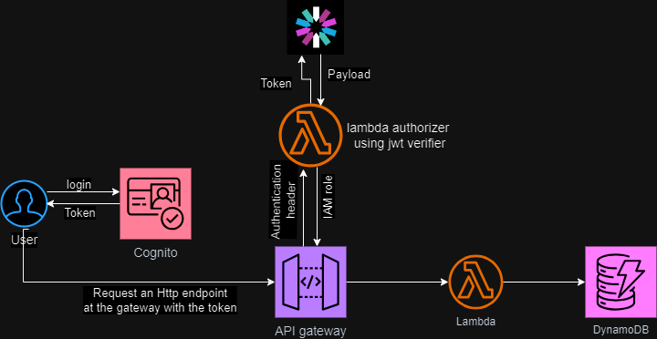

# Buld and Deploy a rest API with AWS serverless services using serverless framework

Authentication is setup for the API and Github Actions is used for deployment.

## What are the resources used in this architecture?

Cognito

API Gateway

Lambda

DynamoDB

IAM

The Diagram below shows the architecture.

